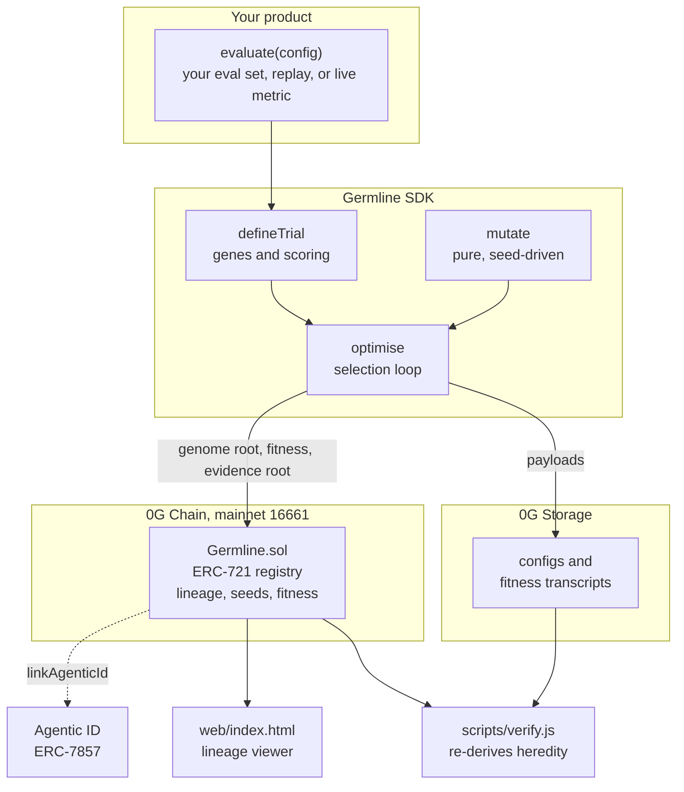
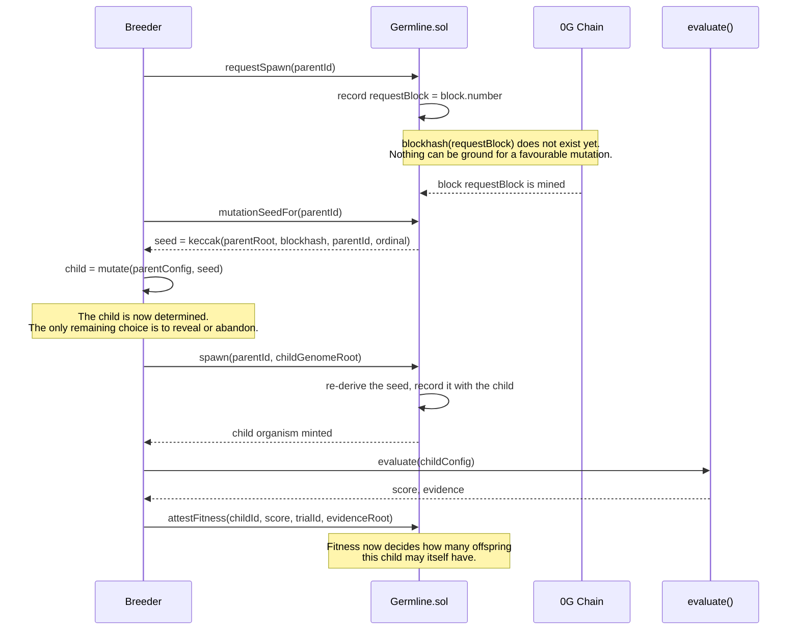

# Architecture

## Components

The arrows that matter are the two leaving `optimise`. Roots go on chain;
payloads go to storage. The chain never holds a configuration, only its hash,
its parentage, and the seed it was derived under.

## One reproduction, step by step

The timing is the mechanism, so it is worth reading closely. The seed does not
exist when the breeder commits.

A commitment expires after 250 blocks, because `blockhash` only reaches back
256. An expired commitment must be remade, which costs another transaction and
is itself recorded -- so abandoning an unfavourable seed is visible rather than
free.

## The gene type system

A genome is a small, fully specified description, deliberately not a pile of
weights: it has to be readable, diffable, and cheap enough that a chain can
carry its hash and a person can see what changed between parent and child.

| type | declaration | mutation |
|---|---|---|
| `bool` | `{ type: 'bool' }` | flips |
| `int` | `{ type: 'int', min, max }` | steps by one, clamped inside the range |
| `choice` | `{ type: 'choice', options: [...] }` | moves to another option |
| `mask` | `{ type: 'mask', bits: n }` | flips one bit, so a set is acquired a member at a time |

Canonical serialisation is stable under key order, because the hash is an
on-chain identity: reordering keys would silently rename every organism ever
born. Gene order is fixed for the same reason.

The reference trial's eight genes are in `engine/genome.js`. They select which
context a predictor may use -- colour, size, neighbourhood ring, momentum --
plus how cautious it is: minimum support, unanimity, and whether to back off to
a less specific context.

## Threat model

What a dishonest breeder could try, and what actually stops it. Where a
defence is partial it says so.

**Grind the seed for a flattering mutation.** Fully prevented. The seed depends
on `blockhash(requestBlock)`, and `requestSpawn` must land in an earlier block
than `spawn`. The contract rejects a spawn in the same block as its request, so
at commitment time the seed is not merely unknown, it does not exist.

**Retry until a good seed appears.** Bounded and visible. A breeder may let a
commitment lapse and request again, but each attempt is a transaction, each
consumes an offspring allowance, and the allowance is earned by measured
fitness. Selection pays for its own search.

**Forge a child that did not descend from its parent.** Fully detectable. The
seed is recorded alongside the child, so anyone with the parent configuration
re-runs `mutate` and compares roots. `test/lifecycle.test.js` breeds an honest
child, has `verify` accept it, then presents a forged child whose root does not
match its seed and confirms rejection.

**Replay a configuration that already exists.** Prevented. `genomeSeen` rejects
a duplicate genome root, on chain, so the same configuration cannot be minted
twice to farm offspring allowance.

**Inflate a fitness score.** Detectable, not prevented. This is the honest
weak point. `attestFitness` requires an evidence root, so a score always points
at a transcript anyone can fetch and recompute -- dishonesty is discoverable
after the fact. But nothing stops an authorised attestor writing a wrong number
in the first place. Two things would close this: multiple independent trials
per organism, and decentralised attestation. Neither is built.

**Breed from a configuration that does not work.** Prevented. Below the
survival threshold `spawnAllowance` returns zero and the contract refuses to
mint. The threshold is the score of a predictor that uses nothing at all, so a
configuration must be at least as useful as having no model.

**Become an attestor and collude.** Not defended. `setAttestor` is held by a
single curator address. This is the most centralised part of the system and is
named as a limitation in the README rather than papered over.

**Break verification by taking storage offline.** Not possible. Roots are
`keccak256` of canonical JSON computed locally, so verification is arithmetic
over bytes the verifier already holds. See `docs/STORAGE.md`.

## Where the state lives

| | on chain | in storage | local only |
|---|---|---|---|
| genome root | yes | -- | -- |
| mutation seed | yes | -- | -- |
| parent, generation, offspring | yes | -- | -- |
| fitness score, trial id, evidence root | yes | -- | -- |
| the configuration itself | -- | yes | cached |
| the fitness transcript | -- | yes | cached |
| the trial corpus | -- | -- | shipped in `engine/trial/` |

The chain holds what must be agreed on and nothing else. That keeps deployment
at 11,381 bytes and a full ten-organism demo at about 0.03 0G.
